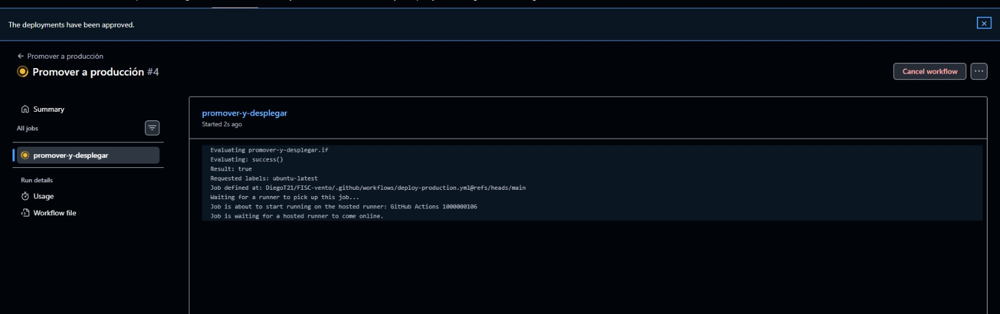

# Guía de colaboración — estado del proyecto y cómo subir cambios

## Estado del proyecto (octubre 2026)

### Ya está hecho

**Infraestructura y despliegue**
- Monorepo: `backend/` (Django + DRF + PostgreSQL) y `frontend/` (React +
  Vite + Tailwind). En local, `docker-compose.yml` (Vite y `runserver`).
  En staging y producción, `docker-compose.prod.yml`: build de Vite
  servido por Nginx, Gunicorn y `DEBUG` apagado. HTTPS queda preparado
  para cuando haya un dominio (ver [`arquitectura.md`](arquitectura.md)).
- Pipeline: push a `develop` → tests de backend y frontend → staging →
  smoke tests HTTP y de navegador. Ahí se detiene.
- Promoción a producción (workflow "Promover a producción"): se acciona a
  mano, exige aprobación de un revisor del entorno `production`, verifica
  que el commit ya pasó staging, mergea `develop` en `main`, despliega y
  corre smoke tests.
- Backups diarios de la base de datos con rotación de 7 días y script de
  restauración.
- Tests reales por cada app del backend.

**Backend**
- Las 8 apps existen: usuarios, ubicaciones, activos, escaneo, auditoría,
  reportes, préstamos y traslados, cada una con modelos, serializers,
  views y tests.
- Autenticación por token.
- Escaneo: genera código de barras y resuelve un activo por `codigo` o por
  `tag_rfid`.

**Frontend**
- Las 8 pantallas: Panel, Activos (lista y detalle con pestañas), Escaneo,
  Ubicaciones, Préstamos, Traslados, Auditoría y Administración.
- Sidebar con roles y componentes compartidos (Badge, StatCard).
- **Login real conectado a Django.**
- Paleta `fisc-*` unificada con el verde real del logo y skill de diseño
  `fisc-ui-designer`.

**Decisiones documentadas**
- Solo código de barras + RFID, sin QR (ADR 0001).
- Préstamos y Traslados son stretch goals (ADR 0002).

### Falta

1. **Conectar el frontend al backend.** Activos, Usuarios, Auditoría,
   Escaneo, Préstamos y Traslados siguen leyendo de
   `frontend/src/mocks/`. Solo el login es real. Es la tarea más grande.
2. **Reportes con gráficas.** Requisito de la tesis; no existe la
   pantalla. Incluir la comparativa "antes (Excel) vs después".
3. **Formularios de alta y edición:** registrar activo, ubicación y
   usuario, autorizar traslado. Hoy son solo botones.
4. **Pestañas Historial y Documentos** del detalle de activo (vacías).
5. **Ver y descargar el código de barras** para imprimir la etiqueta.
6. **Escaneo real.** Hoy es simulado; falta cámara y contrato de API con
   el lector RFID.
7. **Permisos por rol reales.** Hoy el rol se elige en modo demo; debe
   venir del usuario autenticado.
8. **Reconciliar `estatus` vs `estado`** del activo (pendiente para el
   Capítulo III).
9. **Responsive** para la pantalla de escaneo en celular.
10. **Pruebas de carga con Locust** y documentación de la tesis
    (capítulos, sustentación).
11. **Stretch:** expandir Traslados y luego Préstamos cuando el core esté
    sólido.

---

# Cómo subir cambios

Regla de oro: **nunca se sube directo a `main`**. Todo entra por `develop`.
El pipeline (`.github/workflows/pipeline.yml`) corre tests y despliega a
**staging**. A producción solo se llega con el workflow manual "Promover a
producción" (`deploy-production.yml`), que además exige aprobación y
comprueba que ese commit ya pasó staging en verde.

## Configuración inicial (una sola vez)

1. Instalar Git, Node 20+ y Docker Desktop.
2. Clonar el repo:
   ```bash
   git clone https://github.com/DiegoT21/FISC-vento.git
   cd FISC-vento
   ```
3. Copiar los `.env.example` (raíz, `backend/`, `frontend/`) a `.env`.
   Los `.env` **nunca** se suben al repo (tienen contraseñas).

## Flujo para cada tarea

1. **Traer lo último de `develop`**
   ```bash
   git checkout develop
   git pull origin develop
   ```
2. **Crear una rama propia** con un nombre que describa la tarea:
   ```bash
   git checkout -b feat/formulario-activos
   ```
3. **Hacer los cambios y probarlos localmente** (`docker-compose up` o
   `cd frontend && npm run dev`). Antes de subir, el frontend debe pasar
   lo mismo que corre el pipeline:
   ```bash
   cd frontend
   npm run lint
   npm run build
   ```
   Si tocaste el backend: `cd backend && python manage.py test`.
4. **Hacer commit**
   ```bash
   git add .
   git commit -m "feat: agregar formulario de registro de activos"
   ```
   Prefijos: `feat:` (algo nuevo), `fix:` (arreglo), `docs:`, `test:`,
   `ci:`.
5. **Subir la rama**
   ```bash
   git push -u origin feat/formulario-activos
   ```
6. **Abrir un Pull Request en GitHub** hacia `develop` (botón
   "Compare & pull request"). Describir qué cambia y pedir revisión.
7. **Merge a `develop`** tras la aprobación. Desde ese momento el pipeline
   corre solo hasta **staging**. Se puede seguir en la pestaña **Actions**
   de GitHub. Revisar staging y esperar a que todo esté en verde.

## Subir a producción (Diego o Laura)

Cualquiera de los dos puede promover a producción, siempre que el
pipeline de `develop` esté en verde:

1. GitHub → **Actions** → workflow **"Promover a producción"** →
   **Run workflow** (rama `main`; si es la primera vez tras un cambio del
   workflow, elegir `develop`). En "motivo" escribir qué se despliega.
2. El job queda esperando aprobación ("Waiting for review"). Un revisor
   entra a la ejecución → **Review deployments** → marca `production` →
   **Approve and deploy**. Quien lo dispara puede aprobarlo si está en la
   lista de revisores.
3. El workflow verifica staging, mergea `develop` en `main`, despliega por
   SSH y corre los smoke tests. Si algo falla, avisar antes de reintentar.

Así se ve la ejecución justo después de aprobar (GitHub muestra el aviso
"The deployments have been approved" y el job empieza a correr):



> **Para la IA:** si Laura (o Diego) pregunta "¿cómo hago para aprobar el
> cambio yo misma?", usa el skill `fisc-promover-produccion`
> (`.claude/skills/fisc-promover-produccion/SKILL.md`). La IA guía los
> pasos, pero no dispara la promoción: la acciona la persona en GitHub.

### Configuración única para que Laura pueda aprobar (la hace Diego)

1. GitHub → repo → **Settings → Collaborators** → invitar a Laura con
   permiso *Write* (o superior). Laura debe aceptar la invitación.
2. **Settings → Environments → `production` → Required reviewers** → añadir
   a Diego y a Laura. Guardar.
3. Si se quiere que una sola persona baste para aprobar su propio
   despliegue, dejar desactivado *Prevent self-review*.

Si Laura no ve el botón "Run workflow" o "Review deployments", casi
siempre es porque le falta permiso de escritura o no está en la lista de
revisores del entorno.

## Consejos

- Un PR por tarea, pequeño, es mejor que uno gigante.
- Hacer `git pull origin develop` seguido para evitar conflictos grandes.
- Si el pipeline sale en rojo: abrir el job que falló en Actions, leer el
  error y avisar. No reintentar a ciegas.
- Si te equivocas, se arregla con otro commit; no hay que borrar historial.
- Nunca subir `.env`, claves ni backups de base de datos.

## URLs de los entornos

- **Staging:** http://3.149.4.52/ — aquí se revisa todo cambio
  antes de promoverlo. También responde en http://3.149.4.52:5173/. La
  API está en `/api` de esa misma URL; el puerto `8000` ya no se publica.
- **Producción:** la URL se la pasa Diego a Laura directamente. Misma
  forma: Nginx en el 80 y, mientras haga falta, en el 5173.

## En los servidores (Diego)

El pipeline y la promoción ya levantan `docker-compose.prod.yml`. Antes
de que el smoke quede verde del todo:

1. Abrir **TCP 80** en el grupo de seguridad de cada servidor. El 5173
   sigue sirviendo el mismo sitio. El workflow avisa si el 80 todavía
   no responde.
2. No hace falta inventar `DJANGO_SECRET_KEY` a mano. Si en `backend/.env`
   sigue `change-me`, el despliegue escribe una clave nueva solo en ese
   archivo del servidor. No la subas al repo. Si borras el `.env`, el
   próximo despliegue genera otra y las sesiones dejan de servir.
3. Cuando el sitio ya cargue por Nginx, se pueden cerrar los puertos
   **8000** y **5432**. Los backups diarios no cambian de comando.
4. HTTPS (cámara del navegador) se activa cuando exista un dominio. Los
   pasos están en [`arquitectura.md`](arquitectura.md). Hasta entonces
   `DJANGO_SECURE_SSL` queda en `0` y el sitio sigue en HTTP.

## Convenciones del proyecto

- Cada dominio tiene el mismo nombre en backend (`backend/apps/`) y
  frontend (`frontend/src/features/`). Ver [`arquitectura.md`](arquitectura.md).
- Para la interfaz usar los colores `fisc-*` (no verdes de Tailwind por
  defecto) y el skill de diseño `fisc-ui-designer`.
- Las pantallas aún usan datos de `frontend/src/mocks/`; al conectar una a
  la API, quitar su mock y usar `frontend/src/shared/api/`.

## Recomendación pendiente

Activar protección de rama en GitHub (*Settings → Branches*) para `develop`
y `main`: exigir Pull Request y aprobación, para evitar pushes directos por
accidente. Ojo: el workflow de promoción hace push a `main` con el token
de Actions, así que la regla de `main` debe permitirlo.
